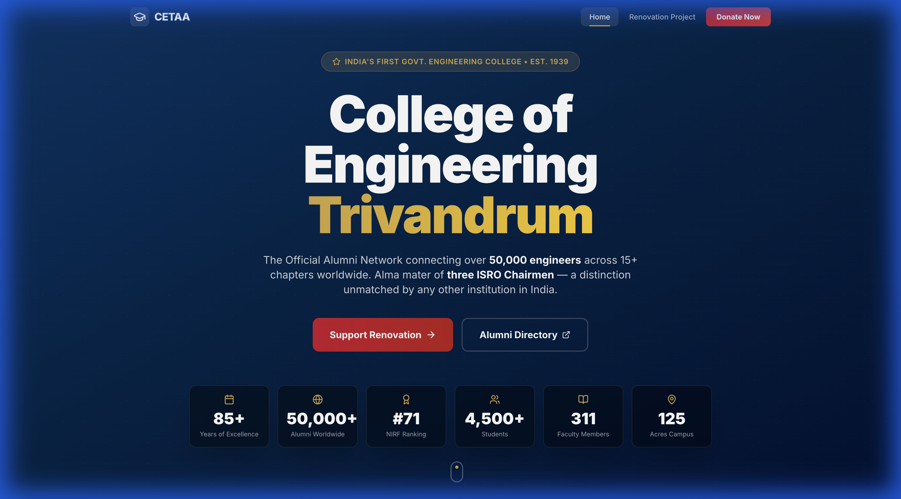

# CETAA — College of Engineering Trivandrum Alumni Association

Official website for CETAA, connecting 50,000+ alumni across 15+ chapters worldwide.



## Features

- 🏛 **Heritage Section** — 85+ years of CET history since 1939
- 🎓 **Distinguished Alumni** — Tabbed directory of notable alumni (Electrical, Civil, Mechanical)
- 📊 **NIRF Rankings** — Animated counters showcasing achievements
- 🏗 **Renovation Campaign** — Before/after image sliders for CETAA Hall renovation
- 💰 **Scholarship Info** — GEMS, CARE, and HOPE Plus programs
- 👥 **Executive Committee** — Full committee grid (2024–26)
- 📅 **CET Chronicle** — Interactive timeline from 1939 to 2039
- 📱 **Fully Responsive** — Works on mobile, tablet, and desktop

### Visual Navigation

| **Home** | **Renovation** |
|:---:|:---:|
|  |  |
| **Welcome to CETAA** | **Rebuilding Our Legacy** |

| **Alumni & History** | **Community** |
|:---:|:---:|
|  |  |
| **Distinguished Alumni** | **Executive Committee** |

| **Scholarships** | **Timeline** |
|:---:|:---:|
|  |  |
| **Supporting Students** | **Through the Years** |

### Renovation Gallery


## Tech Stack

React 19 · Vite · Tailwind CSS · Framer Motion · React Router

## Getting Started

```bash
git clone https://github.com/josephjohnson10/Cetaa.git
cd Cetaa
npm install
npm run dev
```

Open **http://localhost:5173** in your browser.

## Build

```bash
npm run build
```

## Deployment

Push to GitHub and deploy on [Netlify](https://netlify.com) or [Vercel](https://vercel.com).

- **Build command:** `npm run build`
- **Publish directory:** `dist`

## License

© 2026 College of Engineering Trivandrum Alumni Association.
